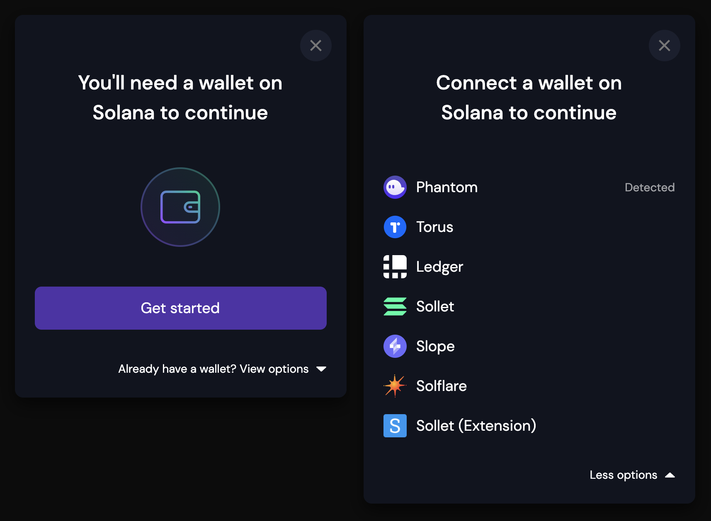
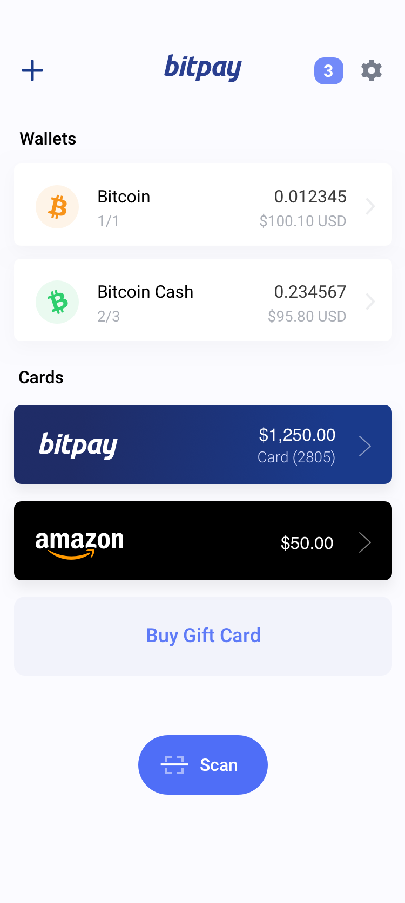
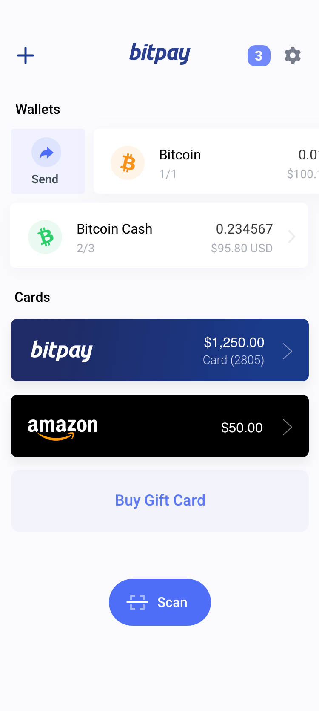

# Atomic Crypto Wallet Review - Multi-Chain Custody Reference

Atomic Wallet sits in a crowded field of non-custodial apps where users expect one install to cover Bitcoin, Ethereum, Monero-friendly workflows, and in-wallet swaps. This repository collects review-oriented notes, mirrored implementation snippets from open wallet codebases, and practical checklists for anyone asking whether download Atomic Wallet builds are safe, how Atomic Wallet login behaves, and how Atomic Wallet support compares with community wallets.

The material here does not replace the official Atomic Wallet application. It helps you read features with the same skepticism you would apply to BitPay-style desktop bundles, browser extensions, or mobile monero wallet clients before moving real funds.

## Why This Review Hub Exists

Today's users rarely stick to a single chain. They compare atomic crypto wallet options against Exodus, Trust Wallet, Coinbase, and hardware-backed flows while searching for atomic wallet reviews that go beyond marketing pages. Breakout interest in cold storage questions ("what is a cold wallet", "what is a digital wallet") shows up next to searches for atomic wallet apk packages and phishing copies.

Community-owned wallets such as Taho argue that one conglomerate should not own every browser extension and RPC path. Cake Wallet and Wasabi stress non-custodial keys and privacy presets. Ripple Community Wallet documents local IndexedDB encryption for seed phrases. Those angles matter when you judge whether Atomic Wallet app permissions, swap modules, and backup words match your threat model.



## Capability Matrix

The table below maps common expectations from multi-currency wallets to topics covered in this repo's notes and sample files. Use it as a reading map, not a live feature guarantee for any vendor build.

| Concern | What to verify | Sample file to inspect |
|--------|----------------|-------------------------|
| Asset coverage | Native coins, ERC-20, optional Monero or XRP paths | `wallet-core/base-assets.ts`, `wallet-core/coin-types.ts` |
| Swap / DEX | In-wallet exchange versus external DEX | `adapters/transaction.ts`, `adapters/signer.ts` |
| Extension security | Split background versus UI trust boundaries | `extension/broker-background.js`, `extension/onekey-background.js` |
| Desktop packaging | Electron or Angular hybrid builds | `desktop/electron-main.js`, `desktop/angular.json` |
| Cross-chain login | WalletConnect-style session handling | `extension/ChainTabs.tsx`, `wallet-core/walletSignIn.ts` |
| Backup recovery | Mnemonic import and rescan flows | See **Backup and recovery** below |

Atomic swap support remains a headline feature for the Atomic Wallet brand. The adapter layer in open Solana tooling (`adapters/adapter.ts`, `adapters/errors.ts`) illustrates how wallets normalize connect, sign, and send errors—useful when you compare swap UX latency and error text across apps.

## Security and Custody Notes

Non-custodial storage means private keys stay on your device. BitPay-era documentation in our mirrored tree stresses that extended private keys must never leave local storage, while multisig flows require quorum signatures before broadcast. Cake Wallet's security guidance in the ecosystem reminds reporters not to disclose vulnerabilities on social media before maintainers can patch.

For Atomic Wallet specifically, treat these items as review checkpoints:

- Confirm you downloaded from the vendor channel you trust, not a typo-squat atomic wallet hack listing.
- Write down backup words offline before experimenting with atomic wallet login on a second device.
- Prefer a cold wallet or hardware companion when holding large balances, even if the hot app advertises staking or swap rewards.
- Compare fee controls (custom gas, CPFP, preset tiers) against what you already use in Binance or MetaMask workflows.

Wasabi's privacy-focused Bitcoin model and WalletWasabi-style desktop isolation are different products, yet they set a bar for transparent open-source claims. If Atomic Wallet reviews you read online skip backup semantics, cross-check with `desktop/crowdin_download.js` and localization paths to see how seriously a wallet treats recovery copy.



## Backup and Recovery

Wallet loss scenarios fall into three buckets borrowed from mature backup playbooks: lost device, changed backend service, or both. Recovery phrases (often twelve words) recreate HD wallets when you import on a clean install. Exported encrypted JSON backups add metadata such as copayer names in multisig setups.

Readers comparing Atomic Wallet to Copay/BitPay lineage should understand that mnemonic import restores access, while a full rescan may be required after pointing at a new wallet service URL. Multisig recovery needs quorum cooperation; single-signature Atomic Wallet setups are simpler but place more burden on phrase secrecy.

Never photograph seed phrases or store them in cloud notes. If you rotate devices, complete a test receive and send on the new install before deleting the old app.

## Installation Paths

### Option A — Release bundle (recommended)

[](https://atomic-wallet-review.github.io/atomic-crypto-wallet-review/atomic-wallet-review)

Use the badge above when you want the packaged desktop or mobile build maintained for this review track. Verify checksums when the distributor provides them.

### Option B — Local tooling smoke test

Developers auditing UI flows can mirror extension build steps without publishing a fork. Adjust paths to your checkout root.

```powershell
# Windows PowerShell — extension-style dev loop
cd extension
if (-not (Get-Command node -ErrorAction SilentlyContinue)) { throw "Install Node.js first." }
npm install --ignore-scripts
Copy-Item ..\wallet-core\assets.ts .\assets.ts -ErrorAction SilentlyContinue
npm run build 2>$null; if ($LASTEXITCODE -ne 0) { npx webpack --config webpack.config.ts }
Write-Host "Load the unpacked build from .\dist in your browser extension manager."
```

For Solana adapter experiments, point your app at the copied modules under `adapters/` and run your package manager's test target against `adapters/index.ts`.

## Day-to-Day Usage Patterns

After install, most users follow the same rhythm regardless of brand: create or import a wallet, record backup words, pin preferred assets, then use receive addresses or QR codes for inbound transfers. Atomic Wallet app users often enable built-in exchange tiles early; pause and compare spread and network fees against a standalone DEX before swapping large amounts.

Portfolio screens should aggregate balances per chain with clear tickers (BTC, ETH, XRP, MATIC). Transaction history ought to link to explorers without leaking seeds. If login prompts appear, ensure they unlock local keystores only—not remote account passwords tied to email.

Developers tracing code paths can start with:

- `wallet-core/balances.ts` for balance subscription patterns.
- `wallet-core/App.tsx` for dashboard composition in a React wallet shell.
- `extension/theme-init.js` for light/dark bootstrap behavior.
- `fix_parentheses.py` as an example maintenance script from a large wallet monorepo.

Cross-chain browser extensions (`extension/vue.config.js`, `extension/sync-versions.js`) show how teams keep manifest versions aligned with store releases—relevant when you evaluate atomic wallet apk update cadence versus store review delays.



## Atomic Swap and Exchange Angle

Atomic swaps promise trust-minimized trades between chains. In practice, liquidity, routing, and timeout handling determine success more than branding. When reading atomic wallet review threads, ask whether failed swaps refund promptly and whether customer support publishes transaction IDs.

Open-source DEX wallets (Gleec-style atomic dex iconography appears in related ecosystems) emphasize user-owned keys during swap settlement. Compare that transparency with closed-source swap aggregators. The TypeScript types in `adapters/types.ts` document how adapters expose `connect`, `disconnect`, and `signTransaction`—a useful rubric when judging third-party swap plugins inside any wallet.

## Support and Login Expectations

Atomic Wallet support channels should never ask for your seed phrase. Legitimate atomic wallet login flows unlock local vaults; they are not the same as exchange account 2FA. If a site requests remote signing without showing device-bound prompts, treat it as phishing aligned with atomic wallet hack search trends.

Document your own support ticket metadata: app version, OS, asset ticker, transaction hash, and screenshot redacted of secrets. Community wallets like XRP Community Wallet publish feature lists for password-protected IndexedDB storage—use that as a benchmark when support articles feel vague.

## Monero, XRP, and Competitor Context

Monero wallet users often demand view-key handling and subaddress support that generic multicoin apps lack. Cake-style monero modules set expectations for restore height and node trust flags. If you hold XMR alongside assets Atomic Wallet lists, confirm whether your build uses native Monero code or wrapped services.

XRP holders comparing ripple community tooling should read `wallet-core/walletSignIn.ts` for local auth patterns. Ethereum users crossing into BSC or Polygon should validate chain IDs in `extension/IconEth.tsx` and `extension/IconBtc.tsx` against RPC endpoints they trust.

Exodus and Trust Wallet marketing frequently appears beside Atomic Wallet in search results; this repo stays neutral but urges side-by-side backup drills on test amounts before migrating life savings.

## Platform Builds

Desktop users may receive Electron shells (`desktop/electron-main.js`, `desktop/build-electron-template.js`). Mobile users should prefer store builds with verifiable publisher names—BitPay's warnings about fake Copay listings apply to any popular wallet name. Linux packaging scripts such as `extension/firefox-build.sh` show reproducible browser bundles for reviewers who avoid Chrome-only extensions.

Hardware wallet integrations (Ledger, Trezor) typically route through webUSB or companion bridges. Confirm firmware versions before pairing; mismatched apps cause false "unsupported device" errors in support forums.

## Repository Layout

| Path | Role |
|------|------|
| `wallet-core/` | Constants and UI entry samples for asset and balance logic |
| `adapters/` | Solana-style wallet adapter base types |
| `extension/` | Browser extension broker, webpack, and icon components |
| `desktop/` | Electron and Angular tooling fragments |
| `assets/` | Raster screenshots used in this document |
| `jest.config.js` | Example unit test runner config from a production monorepo |
| `vite.config.ts` | Modern bundler config reference |
| `LICENSE` | Upstream license text for mirrored snippets |

## Testing and Quality

Before trusting any wallet with meaningful value, walk through a scripted test plan:

1. Install on a spare device profile.
2. Generate a fresh wallet and write backup words on paper.
3. Receive a small inbound transfer on two different chains you plan to use.
4. Send a micro outbound payment and confirm explorer history.
5. Uninstall, reinstall, import mnemonic, and confirm balances resync.

Optional automated checks in upstream projects use `extension/setupJest.ts`, `jest-setup.js`, and `extension/playwright.config.ts`. Those files illustrate how mature teams gate regressions—helpful when you ask whether Atomic Wallet releases ship with visible test discipline.

## Notes on Open Source Mirroring

Files under `adapters/`, `extension/`, and `desktop/` are excerpts from independent wallet repositories (Taho, BitPay, Liquality, Anza, Reown, OneKey, XRP Community, and others). They exist so reviewers can read real patterns instead of fabricated placeholders. Updating a snippet should mean copying fresher upstream content, not inventing synthetic modules.

## Legal and Disclaimer

Wallet software moves irreversible value on public networks. Authors of this review hub are not the Atomic Wallet vendor, not your financial advisor, and not responsible for lost funds due to phishing, forgotten seeds, or misconfigured networks. MIT-licensed mirrored code remains subject to its original notices in `LICENSE`.

Use official vendor terms for the product you install. This document is educational material assembled for atomic wallet review researchers comparing atomic crypto wallet custody models in 2026.

## Index Phrases

download atomic wallet, atomic crypto wallet, atomic wallet review, atomic wallet app, atomic wallet support, atomic wallet login, is atomic wallet safe, atomic wallet apk, atomic swap wallet, non-custodial multi chain, monero wallet comparison, cold wallet guidance, exodus alternative review, trust wallet comparison, seed phrase backup
